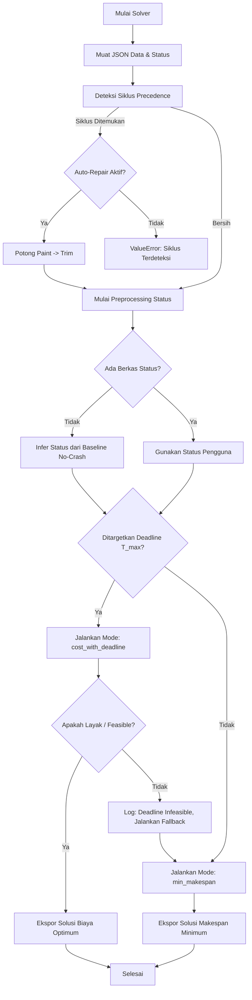

# Formulasi Model Optimisasi Matematika (CP-SAT Project Crashing)

Dokumen ini menjelaskan formulasi model pemrograman batasan (Constraint Programming) yang diimplementasikan dalam berkas [solve_project_crashing.py](file:///Users/macintoshhd/Documents/Adiel/pemod/Pemod-3.0/project-crashing/solve_project_crashing.py) menggunakan pustaka **Google OR-Tools CP-SAT Solver**.

Model ini memecahkan masalah **Dynamic Resource-Constrained Project Scheduling Problem with Time-Cost Trade-offs (RCPSP-TCT)** dengan durasi diskrit dan biaya crashing linier.

---

## 1. Himpunan (Sets) dan Parameter

### Himpunan (Sets)
*   $A$: Himpunan semua aktivitas (tasks) dalam proyek.
*   $R$: Himpunan jenis sumber daya (resources).
*   $E \subseteq A \times A$: Himpunan relasi ketergantungan (precedence). Jika $(p, a) \in E$, maka aktivitas $p$ adalah pendahulu langsung (*predecessor*) dari aktivitas $a$.
*   $A_{\text{active}} \subseteq A$: Himpunan aktivitas yang berstatus aktif/belum selesai pada hari peninjauan saat ini ($t_{\text{now}}$).

### Parameter Proyek
*   $nt_a \in \mathbb{Z}^+$: Durasi normal (normal time) untuk aktivitas $a \in A$.
*   $mt_a \in \mathbb{Z}^+$: Durasi minimum (min time) untuk aktivitas $a \in A$ setelah crashing maksimum, dengan $mt_a \le nt_a$.
*   $dem_{a, r} \in \mathbb{Z}^+$: Kebutuhan harian aktivitas $a \in A$ terhadap sumber daya $r \in R$.
*   $cap_r \in \mathbb{Z}^+$: Kapasitas harian maksimum yang tersedia untuk sumber daya $r \in R$.
*   $cc_a \in \mathbb{R}^+$: Biaya per hari untuk menyingkat (*crashing*) durasi aktivitas $a \in A$.
*   $T_{\text{max}} \in \mathbb{Z}^+$: Batas waktu akhir proyek (*target end date/deadline*).
*   $t_{\text{now}} \in \mathbb{Z}^+$: Hari saat ini (current day) di mana optimisasi/penjadwalan ulang dinamis dijalankan.
*   $H \in \mathbb{Z}^+$: Horizon waktu perencanaan (batas atas waktu penyelesaian terjauh).

### Parameter Status Pelaksanaan ($st_a$) untuk $a \in A$
*   $\text{status}_a \in \{\text{"not\_started"}, \text{"in\_progress"}, \text{"completed"}\}$: Status pelaksanaan aktivitas $a$ pada hari $t_{\text{now}}$.
*   $\text{actual\_start}_a \in \mathbb{Z}^+$: Hari mulai aktual untuk aktivitas $a$ (diperlukan jika status $\in \{\text{"in\_progress"}, \text{"completed"}\}$).
*   $\text{actual\_duration}_a \in \mathbb{Z}^+$: Durasi aktual aktivitas $a$ yang telah selesai.
*   $\text{actual\_end}_a \in \mathbb{Z}^+$: Hari selesai aktual aktivitas $a$ yang telah selesai (alternatif dari $\text{actual\_duration}_a$).

---

## 2. Variabel Keputusan (Decision Variables)

Untuk setiap aktivitas $a \in A$, didefinisikan variabel keputusan integer berikut dalam solver CP-SAT:

| Variabel | Jenis | Batasan Domain | Definisi |
| :--- | :--- | :--- | :--- |
| $s_a$ | Integer | $[0, H]$ | Hari mulai (*start time*) aktivitas $a$. |
| $d_a$ | Integer | $[mt_a, nt_a]$ | Durasi aktual (*duration*) aktivitas $a$. |
| $e_a$ | Integer | $[0, H]$ | Hari selesai (*end time*) aktivitas $a$. |
| $c_a$ | Integer | $[0, nt_a - mt_a]$ | Jumlah hari pemangkasan durasi (*crash days*) aktivitas $a$. |
| $iv_a$ | Interval | `IntervalVar(s_a, d_a, e_a)` | Variabel interval CP-SAT yang mengikat hubungan $s_a$, $d_a$, dan $e_a$. |

### Variabel Proyek Global
*   $C_{\text{max}}$: Variabel integer dalam domain $[0, H]$ yang menyatakan waktu penyelesaian proyek (makespan).
*   $Z_{\text{scaled}}$: Variabel integer tujuan untuk meminimalkan total biaya crash setelah diskalakan.

---

## 3. Batasan Model (Constraints)

### 3.1 Hubungan Durasi dan Crashing
Setiap aktivitas harus memenuhi hubungan fisik antara durasi normal, jumlah hari crash, durasi aktual, dan waktu mulai-selesai:
1. Hubungan jumlah hari crash dengan durasi:
   $$d_a + c_a = nt_a \quad \forall a \in A$$
2. Hubungan awal, durasi, dan akhir aktivitas:
   $$e_a = s_a + d_a \quad \forall a \in A$$
   *(Hubungan ini ditegakkan secara internal oleh objek `IntervalVar` di CP-SAT)*.

### 3.2 Ketergantungan Aktivitas (Precedence)
Untuk setiap relasi ketergantungan $(p, a) \in E$, aktivitas $a$ hanya boleh dimulai setelah aktivitas pendahulunya $p$ selesai:
$$s_a \ge e_p \quad \forall (p, a) \in E$$

### 3.3 Kapasitas Sumber Daya (Cumulative Resource Capacity)
Pada setiap hari proyek berlangsung, total penggunaan sumber daya $r \in R$ oleh semua aktivitas yang sedang aktif tidak boleh melebihi kapasitas $cap_r$:
$$\text{Cumulative}\Big(\{iv_a \mid a \in A \text{ dan } dem_{a, r} > 0\}, \{dem_{a, r} \mid a \in A \text{ dan } dem_{a, r} > 0\}, cap_r\Big) \quad \forall r \in R$$
Batasan ini dimobilisasi secara efisien menggunakan fitur `AddCumulative` CP-SAT.

### 3.4 Penguncian Status Dinamis (Dynamic State Locking)
Berdasarkan status riil aktivitas pada hari peninjauan $t_{\text{now}}$, solver menerapkan batasan pengunci (*locks*) berikut:

1. **Aktivitas belum dimulai (`status_a == "not_started"`)**:
   Aktivitas hanya boleh dijadwalkan mulai pada hari $t_{\text{now}}$ atau setelahnya:
   $$s_a \ge t_{\text{now}}$$

2. **Aktivitas sedang berjalan (`status_a == "in_progress"`)**:
   *   Hari mulai dikunci ke hari mulai aktual yang tercatat:
       $$s_a = \text{actual\_start}_a$$
   *   Aktivitas tidak boleh selesai sebelum hari peninjauan saat ini berakhir (karena statusnya masih berjalan):
       $$e_a \ge t_{\text{now}} + 1$$
   *   Durasi aktivitas tidak dapat di-crash di bawah hari-hari yang telah dilewati:
       $$\text{elapsed}_a = t_{\text{now}} - \text{actual\_start}_a$$
       $$d_a \ge \max(mt_a, \text{elapsed}_a + 1)$$
       Hal ini mencegah solver memotong durasi ke nilai yang secara retrospektif tidak mungkin (misal, meng-crash aktivitas menjadi total durasi 2 hari padahal sudah berjalan selama 3 hari).

3. **Aktivitas sudah selesai (`status_a == "completed"`)**:
   *   Hari mulai dikunci ke hari mulai aktual:
       $$s_a = \text{actual\_start}_a$$
   *   Hari selesai dikunci tidak boleh melebihi hari peninjauan saat ini:
       $$e_a \le t_{\text{now}}$$
   *   Durasi dikunci sesuai durasi aktual yang dilaporkan:
       $$d_a = \text{actual\_duration}_a$$
       *(Jika yang tercatat adalah hari selesai aktual $\text{actual\_end}_a$, maka $e_a = \text{actual\_end}_a$)*.

### 3.5 Batasan Akhir Proyek (Makespan)
Makespan proyek $C_{\text{max}}$ didefinisikan sebagai waktu selesai paling akhir dari seluruh aktivitas:
$$C_{\text{max}} \ge e_a \quad \forall a \in A$$

---

## 4. Fungsi Tujuan (Objective Functions)

Model CP-SAT dapat berjalan dalam dua mode optimisasi berbeda berdasarkan keberadaan target deadline proyek:

### Mode A: Biaya Minimum dengan Batas Waktu (`cost_with_deadline`)
Digunakan jika target batas waktu proyek ($T_{\text{max}}$) ditentukan.

1. **Batasan Deadline**:
   $$C_{\text{max}} \le T_{\text{max}}$$
2. **Minimisasi Biaya Crash Baru**:
   Biaya crash yang sudah terjadi pada masa lalu (dari aktivitas berstatus `completed`) dianggap sebagai *sunk cost* dan diabaikan dari optimisasi aktif. Fungsi tujuan adalah meminimalkan total biaya crash tambahan untuk aktivitas aktif:
   $$\min \sum_{a \in A_{\text{active}}} cc_a \cdot c_a$$

#### Skalasi Bilangan Bulat (Integer Scaling)
Karena OR-Tools CP-SAT hanya menerima nilai koefisien berupa bilangan bulat (integer), parameter biaya riil $cc_a$ yang berupa desimal harus dikonversi.
*   Solver mendeteksi presisi desimal maksimum ($\text{max\_dp}$) dari seluruh $cc_a \in A$.
*   Faktor pengali didefinisikan sebagai:
    $$S = 10^{\text{max\_dp}}$$
*   Koefisien tujuan baru dihitung dengan:
    $$\text{coeff}_a = \lfloor cc_a \cdot S \rfloor \quad \forall a \in A_{\text{active}}$$
*   Fungsi tujuan ter-skalakan yang diminimalkan CP-SAT adalah:
    $$\min \quad Z_{\text{scaled}} = \sum_{a \in A_{\text{active}}} \text{coeff}_a \cdot c_a$$
*   Biaya riil yang dilaporkan pada akhir optimisasi dibagi kembali dengan faktor skala:
    $$\text{Total Cost} = \frac{Z_{\text{scaled}}}{S}$$

### Mode B: Makespan Minimum (`min_makespan`)
Digunakan sebagai fallback jika batas waktu proyek tidak layak (*infeasible*) atau jika $T_{\text{max}}$ sengaja dikosongkan.
Tujuan utamanya adalah mempercepat penyelesaian proyek tanpa memperhitungkan biaya crash:
$$\min \quad C_{\text{max}}$$

---

## 5. Diagram Alir Logika Solver

---

## 6. Pemetaan Formulasi ke Kode Python

Berikut adalah bagian kode di dalam [solve_project_crashing.py](file:///Users/macintoshhd/Documents/Adiel/pemod/Pemod-3.0/project-crashing/solve_project_crashing.py) yang merepresentasikan komponen matematika di atas:

*   **Skalasi Biaya Desimal**: Diimplementasikan pada fungsi `decimal_scale` (Baris 45-51) dan diaplikasikan pada baris 348.
*   **Definisi Variabel Keputusan**: Baris 380-386 mendefinisikan $s_a$, $d_a$, $e_a$, $c_a$, dan `IntervalVar`.
*   **Batasan Precedence**: Baris 389-393 mengikat hubungan ketergantungan tugas.
*   **Batasan Kapasitas Sumber Daya (Cumulative)**: Baris 396-404 menambahkan batasan kapasitas harian kumulatif menggunakan `model.AddCumulative`.
*   **Penguncian Status Dinamis**: Baris 407-452 membatasi domain dan nilai variabel berdasarkan `status_a` (`not_started`, `in_progress`, `completed`).
*   **Definisi Makespan ($C_{\text{max}}$)**: Baris 454-456 mengikat makespan proyek.
*   **Pilihan Fungsi Tujuan**: Baris 459-480 mengatur objektif berdasarkan mode pencarian (`cost_with_deadline` vs `min_makespan`).
